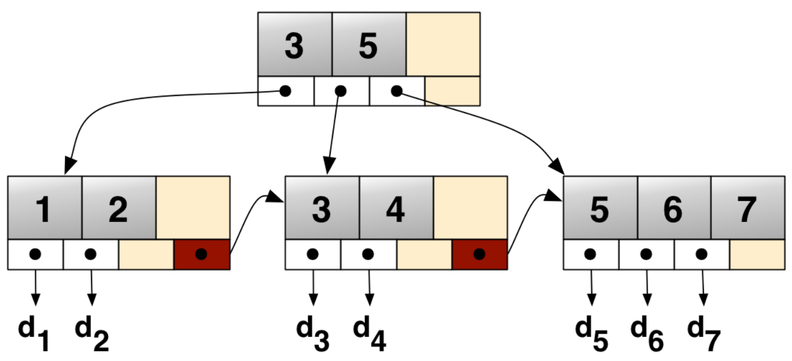

# zuo god
- [总结自左程云 bilibili课程代码](https://www.bilibili.com/video/BV13g41157hK)

|Package|Description|
|---|---|
|bit|位操作|
|sort|排序|
|dichotomy|二分法|
|link|链表|
|tree|二叉树|
|graph|图|
|prefix_tree|前缀树|
|greed|贪心|
|force|暴力递归|
|hash|hash|
|union_set|并查集|
|str|字符串，KMP，Manacher|
|window_max|窗口最大值|
|mono_stack|单调栈|
|limit_resource|资源限制|
|dp|暴力递归改动态规划|
|ordered_table|有序表|
# 计算机bit
```
 * 计算机中负数使用补码表示
 * 1=0000 0001
 * 0=0000 0000
 * -1
 * 原码=1000 0001
 * 补码=1111 1111
 * -2
 * 原码=1000 0010
 * 补码=1111 1110
 * -128
 * 补码=1000 0000
```
# 位运算
- 相反数 `~x+1`
- 最优侧的1 `x&(~x+1)`
# sort
|Type|Profile|
|---|---|
|QuickSort|O(nlogn), recursive O(logn), unstable|
|MergeSort||
|HeapSort||
|RadixSort||
|InsertSort||
|BubbleSort||
|SelectSort||
# 注意
- 代码思想来自左神课程，代码编写由自己完成

# tree套路
- 上下两层，整棵树
- 整棵树：当前结点，左子树，右子树
- 每一个结点都会到达3次
- 遍历次序
- 左子树返回值, 右边子树返回值, 本层返回值

# 有序表
## B+树
